<div style="height: 100pt;">
</div>

<div style="style=display: block; margin-left: auto; margin-right: auto; width: 60%; height: auto;">
  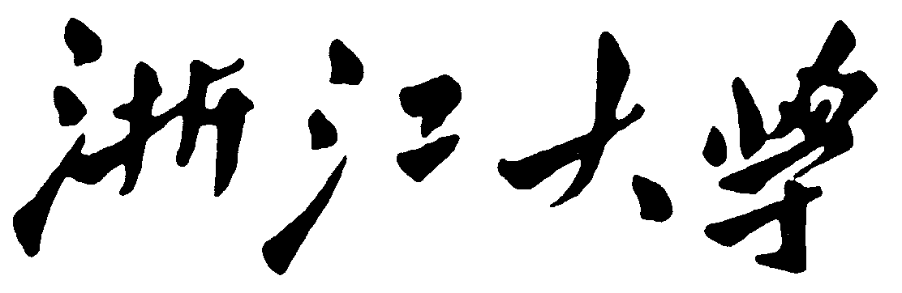
  <br>
  <br>
</div>

<div style="height: 40pt;">
</div>

<div style="text-align:center;font-size:20pt;">
    <strong>暑期深度学习实验报告</strong><br>
    <br>
</div>

<div style="height: 80pt;">
</div>

<div style="display: flex; align-items: center;justify-content: center;font-size:14pt;">
  <div style="display:flex; align-items: center; width: 70pt; background-color: rgba(255, 255, 255, 0);justify-content: center;">
实验名称<span style="margin-right: 7pt">:</span>
</div>
<div style="display:flex; align-items: center; width: 200pt; background-color: rgba(255, 255, 255, 0);justify-content: center;border-bottom: 1pt solid #000;">
MNIST 数字图像分类
</div>
</div>

<div style="height: 7pt;">
</div>

<div style="display: flex; align-items: center;justify-content: center;font-size:14pt;">
  <div style="display:flex; align-items: center; width: 70pt; background-color: rgba(255, 255, 255, 0);justify-content: center;">
小组成员</span><span style="margin-right: 7pt">:</span>
</div>
<div style="display:flex; align-items: center; width: 200pt; background-color: rgba(255, 255, 255, 0);justify-content: center;border-bottom: 1pt solid #000;">
谢<span style="margin-left: 14pt;"></span>集 3220103501
</div>
</div>

<div style="height: 7pt;">
</div>

<div style="display: flex; align-items: center;justify-content: center;font-size:14pt;">
  <div style="display:flex; align-items: center; width: 70pt; background-color: rgba(255, 255, 255, 0);justify-content: center;">
<span style="margin-left: 70pt;"></span>
</div>
<div style="display:flex; align-items: center; width: 200pt; background-color: rgba(255, 255, 255, 0);justify-content: center;border-bottom: 1pt solid #000;">
李浩浩 3220105930
</div>
</div>

<div style="height: 7pt;">
</div>

<div style="display: flex; align-items: center;justify-content: center;font-size:14pt;">
  <div style="display:flex; align-items: center; width: 70pt; background-color: rgba(255, 255, 255, 0);justify-content: center;">
<span style="margin-left: 70pt;"></span>
</div>
<div style="display:flex; align-items: center; width: 200pt; background-color: rgba(255, 255, 255, 0);justify-content: center;border-bottom: 1pt solid #000;">
杨正宇 322010xxxx
</div>
</div>

<div style="height: 7pt;">
</div>

<div style="display: flex; align-items: center;justify-content: center;font-size:14pt;">
  <div style="display:flex; align-items: center; width: 70pt; background-color: rgba(255, 255, 255, 0);justify-content: center;">
<span style="margin-left: 70pt;"></span>
</div>
<div style="display:flex; align-items: center; width: 200pt; background-color: rgba(255, 255, 255, 0);justify-content: center;border-bottom: 1pt solid #000;">
赵一帆 322010xxxx
</div>
</div>

<div style="height: 7pt;">
</div>

<div style="display: flex; align-items: center;justify-content: center;font-size:14pt;">
  <div style="display:flex; align-items: center; width: 70pt; background-color: rgba(255, 255, 255, 0);justify-content: center;">
课程名称<span style="margin-right: 7pt">:</span>
</div>
<div style="display:flex; align-items: center; width: 200pt; background-color: rgba(255, 255, 255, 0);justify-content: center;border-bottom: 1pt solid #000;">
课程综合实践 II
</div>
</div>

<div style="height: 7pt;">
</div>

<div style="display: flex; align-items: center;justify-content: center;font-size:14pt;">
  <div style="display:flex; align-items: center; width: 70pt; background-color: rgba(255, 255, 255, 0);justify-content: center;">
指导老师<span style="margin-right: 7pt">:</span>
</div>
<div style="display:flex; align-items: center; width: 200pt; background-color: rgba(255, 255, 255, 0);justify-content: center;border-bottom: 1pt solid #000;">
杨<span style="margin-left: 14pt;"></span>易，范鹤鹤
</div>
</div>

<div style="height: 7pt;">
</div>

<div style="page-break-before: always;"></div>

<div style="height: 14pt;">
</div>
<hr></hr>

# Part I: 基于 PyTorch 实现

我们将代码开源到了 Github 仓库上，链接为：[https://github.com/DreamKongcheng/Summer2024-Lab/tree/master](https://github.com/DreamKongcheng/Summer2024-Lab/tree/master)。

## 1. 实验背景

### 1.1 `MNIST`

MNIST 数据集来自美国国家标准与技术研究所, National Institute of Standards and Technology (NIST)。训练集（training set）由来自 $250$ 个不同人手写的数字构成，其中 $50\%$ 是高中学生，$50\%$ 来自人口普查局（the Census Bureau）的工作人员。测试集（test set）也是同样比例的手写数字数据，但保证了测试集和训练集的作者集不相交。

MNIST 数据集一共有 $70000$ 张图片，其中 $60000$ 张是训练集，$10000$ 张是测试集。每张图片是 $28\times 28$ 的 $0 \sim 9$ 的手写数字图片组成。每个图片是黑底白字的形式，黑底用 $0$ 表示，白字用 $0\sim 1$ 之间的浮点数表示，越接近 $1$，颜色越白。图片的标签以一维数组的 $\text{one-hot}$ 编码形式给出

### 1.2 Pytorch

`Pytorch` 是 `torch`的 `Python` 版本，是由 `Facebook` 开源的神经网络框架，专门针对 GPU 加速的深度神经网络（DNN）编程。`Torch` 是一个经典的对多维矩阵数据进行操作的张量（`tensor`）库，在机器学习和其他数学密集型应用有广泛应用。与 `Tensorflow` 的静态计算图不同，`Pytorch` 的计算图是动态的，可以根据计算需要实时改变计算图。

其核心是 __张量__ 的计算。

## 2、CNN 和 ResNet 实现 MNIST 手写体识别

### 基础版本的代码书写

利用 `PyTorch` 给出的神经网络库，通过卷积神经网络（`CNN`）和全连接层来进行手写数字的识别。

主要有三个需要实现的部分：神经网络类 `Net`，全局函数 `train`（用于训练模型），全局函数 `test`（用于测试模型），具体的代码实现如下所示。

#### 神经网络类 `Net`

有两个函数，一个是构造函数 `__init__`，一个是前向传播函数 `forward`，用于给定一个输入时给出整个神经网络的输出，即对于数字的识别结果。

```python
def __init__(self):  
    super(Net, self).__init__()  
    self.conv1 = torch.nn.Conv2d(1, 10, kernel_size=5)  
    self.pooling = torch.nn.MaxPool2d(4)  
    self.fc1 = torch.nn.Linear(360, 10)  
```

- **卷积层**：一个卷积层，核的大小是 $5$，从 $1$ 通道到 $10$ 通道；
- **池化层**：采用最大值池化方法，选择 $4×4$ 的方格中最大的一个作为池化结果；
- **全连接层**：有一个全连接层，$360 \rightarrow 10$（根据前面的卷积和池化操作计算得到的结果，如果图像较复杂，可以利用库函数帮助计算）。最后给出一个 $10$ 维的向量作为判断结果，最大的一个就是识别的最终结果；
- **激活函数**：采用 `F.relu` 操作进行激活，这个函数能够有效避免梯度消失的问题。

前向传播函数：

```python
def forward(self, x):
    batch_size = x.size(0)
    x = F.relu(self.pooling(self.conv1(x)))
    x = x.view(batch_size, -1)  # 转化张量的形状
    x = self.fc1(x)
    return x
```

注意 $x$ 的本质是张量（`tensor`），进行卷积、池化、激活、铺平、全连接，得到最后的判别结果。

#### 其它核心代码

```python
criterion = torch.nn.CrossEntropyLoss()
optimizer = optim.SGD(model.parameters(), lr=0.01, momentum=0.5, weight_decay=1e-4)
```

利用交叉熵损失函数作为损失标准，优化器采用 `SGD`，具体的参数 `lr`、`momentum` 和 `weight_decay` 设置相应适当的值即可。

#### 训练函数

```python
def train(epoch):
    running_loss = 0.0
    for batch_idx, data in enumerate(train_loader, 0):
        inputs, target = data
        optimizer.zero_grad()

        outputs = model(inputs)
        loss = criterion(outputs, target)
        loss.backward()
        optimizer.step()

        running_loss += loss.item()
        if batch_idx % 300 == 299:
            print('[%d, %5d] loss: %.3f' % (epoch + 1, batch_idx + 1, running_loss / 300))
            running_loss = 0.0
```

从 `train_loader` 中一批一批加载数据（批的大小设置为 $32$），进行前向传播 -> 误差后向传播 -> 链式求导 -> 梯度下降的方法进行模型优化。每 $300$ 个批次输出一次损失值，以便更好地监控程序的运行过程。

#### 测试函数

```python
def test(epoch):
    correct = 0
    total = 0
    with torch.no_grad():
        for data in test_loader:
            images, labels = data
            outputs = model(images)
            _, predicted = torch.max(outputs.data, dim=1)
            total += labels.size(0)
            correct += (predicted == labels).sum().item()
```

利用测试集中的 $10000$ 张图片进行测试，计算模型判断结果和标签相同的比例，作为此时模型的识别准确率并进行输出。

对这个版本进行测试，设置 `batch_size = 32`，`epoch = 30`，实验的结果如下所示：

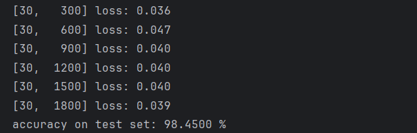

准确率达到了 $98.45\%$，实验效果比较理想，不过仍有较大提升空间。

再观察这次测试 $30$ 次迭代过程中准确率（`accuracy`）的变化趋势：

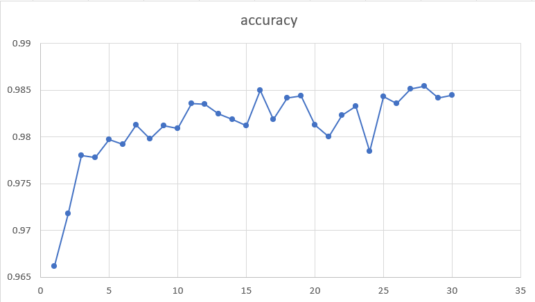

整体呈现上升趋势，随着迭代次数不断增加，上升的速度逐渐减小。不过局部仍有波动，例如第 $24$ 次迭代其准确率小于 $0.98$，这个结果不是很理想，说明模型训练的稳定性仍不足。

### 基础版本的若干改进

#### 2.1 调整参数

主要是对优化器的部分进行改进。

```python
optimizer = optim.SGD(model.parameters(), lr=0.01, momentum=0.5, weight_decay=1e-3)
```

改变学习率 `lr` 为 $0.002$，其它保持不变，测试结果如下：

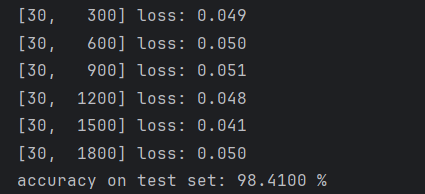

最后的结果差别不大，但是观察整个训练过程发现，开始时准确率较低：

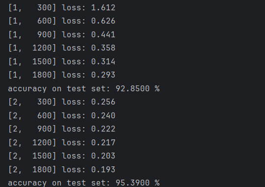

第一次迭代只有 $92.85\%$ 的准确率。

改变学习率 `lr` 为 $0.05$，其它保持不变，测试结果如下：


最后的结果差别同样不大，但是观察整个训练过程发现，开始时准确率较高：

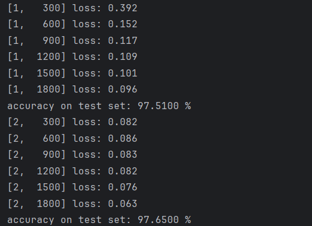

第一次迭代就可以达到 $97.51\%$ 的准确率。

通过上述尝试，发现学习率的高低对于最终结果的影响有限，主要影响迭代过程中的收敛速度。

接下来改变正则化项 `weight_decay`。

改变 `weight_decay` 为 `1e-4`，其它保持不变，测试结果如下：

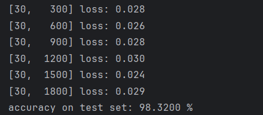

准确率为 $98.32\%$，与原始版本差别不大。

改变 `weight_decay` 为 `1e-2`，其它保持不变，测试结果如下：

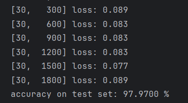

准确率为 $97.97\%$，较最初版本有所下降。

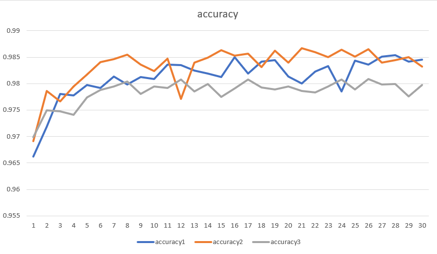

`accuracy1` 表示 `weight_decay` 为 `1e-3` 的学习曲线，`accuracy2` 表示 `weight_decay` 为 `1e-4` 的学习曲线，`accuracy3` 表示 `weight_decay` 为 `1e-2` 的学习曲线。当 `weight_decay` 过大时确实会对模型的识别效果产生影响，导致欠拟合，而没有 `weight_decay` 正则化项也是不可取的，这样会导致模型过拟合，降低模型在测试集上的准确率。

#### 2.2 改变神经网络的层数和结构

通过 $2.1$ 的测试，采用 `lr = 0.01`，`weight_decay = 1e-4` 的 `optimizer` 来进行后续模型的训练和测试，以达到更好的效果。

我尝试通过增加模型的层数来达到更好的效果，具体的方法如下：将一个卷积层 + 一个池化层的网络增加到两个卷积层 + 两个池化层，使模型更好地提取图的有效信息，抛弃无效的干扰信息。

同时，增加全连接层的数量，在 `320 -> 10` 的过程中增加 $128$ 和 $32$ 两层，将 `320 -> 10` 的过程有 $3$ 个全连接层来完成，使得模型拥有更好的识别效果。

每两层中间使用 `ReLU` 激活函数进行激活。

在这种情况下，神经网络类 `Net` 的代码修改如下：

```python
class Net(torch.nn.Module):
    def __init__(self):
        super(Net, self).__init__()
        self.conv1 = torch.nn.Conv2d(1, 10, kernel_size=5)
        self.pooling = torch.nn.MaxPool2d(2)
        self.conv2 = torch.nn.Conv2d(10, 20, kernel_size=5)
        self.fc1 = torch.nn.Linear(320, 128)
        self.fc2 = torch.nn.Linear(128, 32)
        self.fc3 = torch.nn.Linear(32, 10)

    def forward(self, x):
        batch_size = x.size(0)
        x = F.relu(self.pooling(self.conv1(x)))
        x = F.relu(self.pooling(self.conv2(x)))
        x = x.view(batch_size, -1)  # -1 此处自动算出的是320
        x = self.fc1(x)
        x = F.relu(x)
        x = self.fc2(x)
        x = F.relu(x)
        x = self.fc3(x)
        return x
```

其它部分保持不变，对这个程序进行测试，结果如下：

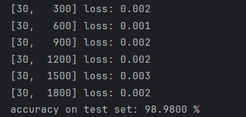

$98.98\%$ 已经非常接近 $99\%$，而且在学习过程中，准确率一度达到了 $99.15\%$:


然后再将 `ReLU` 函数更换为 `LeakyReLU`，也就是 $x < 0$ 部分有较小的斜率，在这种情况下，测试结果如图所示：

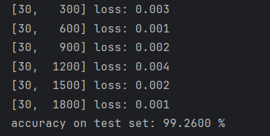

模型准确率高达 $99.26\%$，而且稳定性极佳，从第 $19$ 次迭代之后始终高于 $99\%$，最高一次达到 $99.29\%$，也就是说在整个测试集 $10000$ 个手写数字中只有 $71$ 张识别错误。

这是在我多次尝试过程中效果最好的一个模型，接下来再总结一下这个模型的构成和学习过程：

#### 模型的构成：

1. 卷积层，核大小为 $5$，`padding = 0`，$1$ 通道到 $10$ 通道；
2. 池化层，二维 $2 × 2$ 最大值池化；
3. 激活函数层，采用 `LeakyReLU` 作为激活函数；
4. 卷积层，核大小为 $5$，`padding = 0`，$10$ 通道到 $20$ 通道；
5. 池化层，二维 $2 × 2$ 最大值池化；
6. 激活函数层，采用 `LeakyReLU` 作为激活函数；
7. 全连接层，$320 \rightarrow 128$;
8. 激活函数层，采用 `LeakyReLU` 作为激活函数；
9. 全连接层，$128 \rightarrow 32$;
10. 激活函数层，采用 `LeakyReLU` 作为激活函数；
11. 全连接层，$32 \rightarrow 10$。

#### 模型的学习过程：

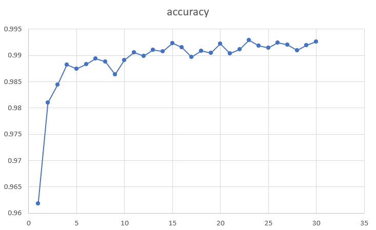

#### 2.3 利用 `ResNet` 进行改进 

`ResNet`，全称为残差网络（`Residual Network`），是一种深度学习架构，主要用于图像识别和分类任务。它由 Kaiming He 等人在 $2015$ 年的论文《Deep Residual Learning for Image Recognition》中首次提出。`ResNet` 特别擅长处理非常深的神经网络，能够缓解深度神经网络训练中的梯度消失和梯度爆炸问题。

其主要特点包括：

- **残差学习**：`ResNet` 的核心思想是引入了“残差学习”的概念。在传统的卷积神经网络中，每一层都试图直接学习输入和输出之间的映射关系。而在 `ResNet` 中，每一层不仅学习输入到输出的映射，还学习输入直接映射到输出的残差（即输入和输出之间的差异）。这种设计使得网络可以通过堆叠更多的层来增加深度，而不会损害训练性能。
- **残差块**：`ResNet` 由多个残差块（`Residual Blocks`）组成，每个残差块包含两条路径：一条是卷积层的堆叠，另一条是输入的恒等映射（即直接将输入添加到卷积层的输出）。这两条路径的输出相加，形成残差块的最终输出。
- **深层网络**：`ResNet` 能够实现非常深的网络结构，常见的有 `ResNet-18`、`ResNet-34`、`ResNet-50`、`ResNet-101` 和 `ResNet-152` 等变体，数字表示网络中的残差块数量。这些深层网络在图像识别任务中表现出色。
- **解决梯度问题**：通过残差块的设计，`ResNet` 能够有效地解决深层网络训练中的梯度消失和梯度爆炸问题，使得训练更深的网络成为可能。

受限于笔记本电脑的运算能力，我没办法采用相当深的网络，只尝试了拥有 $8$ 层网络的 `ResNet`，参数仍采用上述模型得到最优的参数，仍取得了比较好的识别效果。

一个 `BasicBlock` 的类如下定义：

```python
class Basicblock(nn.Module):
    def __init__(self, in_planes, planes, stride=1):
        super(Basicblock, self).__init__()
        self.conv1 = nn.Sequential(
            nn.Conv2d(in_channels=in_planes, out_channels=planes, kernel_size=3, stride=stride, padding=1, bias=False),
            nn.BatchNorm2d(planes),
            nn.ReLU()
        )
        self.conv2 = nn.Sequential(
            nn.Conv2d(in_channels=planes, out_channels=planes, kernel_size=3, stride=1, padding=1, bias=False),
            nn.BatchNorm2d(planes),
        )

        if stride != 1 or in_planes != planes:
            self.shortcut = nn.Sequential(
                nn.Conv2d(in_channels=in_planes, out_channels=planes, kernel_size=3, stride=stride, padding=1),
                nn.BatchNorm2d(planes)
            )
        else:
            self.shortcut = nn.Sequential()

    def forward(self, x):
        out = self.conv1(x)
        out = self.conv2(out)
        out += self.shortcut(x)
        out = F.relu(out)
        return out
```

`out += self.shortcut(x)` 是 `ResNet` 的核心，它使得每一个 `BasicBlock` 的输出中都有一个输入，也就是模型结果和输入的叠加，这样避免了梯度消失的问题，使得模型可以构建得非常深。

网络类基于 `BasicBlock` 类来构建，其具体的定义如下所示：

```python
class ResNet(nn.Module):
    def __init__(self, block, num_block, num_classes):
        super(ResNet, self).__init__()
        self.in_planes = 16
        self.conv1 = nn.Sequential(
            nn.Conv2d(in_channels=1, out_channels=16, kernel_size=3, stride=1, padding=1),
            nn.BatchNorm2d(16),
            nn.ReLU()
        )
        self.maxpool = nn.MaxPool2d(kernel_size=3, stride=1, padding=1)

        self.block1 = self._make_layer(block, 16, num_block[0], stride=1)
        self.block2 = self._make_layer(block, 32, num_block[1], stride=2)
        self.block3 = self._make_layer(block, 64, num_block[2], stride=2)

        self.outlayer = nn.Linear(64, num_classes)

    def _make_layer(self, block, planes, num_block, stride):
        layers = []
        for i in range(num_block):
            if i == 0:
                layers.append(block(self.in_planes, planes, stride))
            else:
                layers.append(block(planes, planes, 1))
        self.in_planes = planes
        return nn.Sequential(*layers)

    def forward(self, x):
        x = self.maxpool(self.conv1(x))
        x = self.block1(x)                 
        x = self.block2(x)             
        x = self.block3(x)             
        x = F.avg_pool2d(x, 7)     
        x = x.view(x.size(0), -1)             
        out = self.outlayer(x)
        return out
```

首先是一个卷积层和一个池化层，接下来是若干 `BasicBlock` 的结构 `block1`，`block2`，`block3`，在初始化时通过参数指定每一个结构中包含的 `BasicBlock` 的数量。

`_make_layer` 使得构造每一个结构中的若干 `BasicBlock` 的过程得以封装，操作更加简便。

采用这个模型进行测试，结果如下：

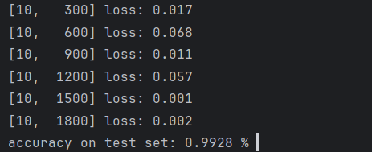

由于模型较为庞大，迭代速度比较缓慢，只采用 `epoch = 10` 进行训练，仍然达到了 $99.28\%$ 的准确率，体现出 `ResNet` 的优越性。

迭代过程中准确率的变化趋势如下所示：


收敛速度快且训练过程较为稳定，是比较理想的模型。

### 实验过程

大部分的实验结果已经在第二部分中进行展示，这里再进行一个归纳：

|网络|学习率 lr|正则化系数 weight\_decay|最后一次迭代准确率|
|:--:|:--:|:--:|:--:|
|一个卷积层 + 一个池化层|$0.01$|$1e-3$|$98.45\%$|
|一个卷积层 + 一个池化层|$0.002$|$1e-3$|$98.41\%$|
|一个卷积层 + 一个池化层|$0.05$|$1e-3$|$98.30\%$|
|一个卷积层 + 一个池化层|$0.01$|$1e-4$|$98.32\%$|
|一个卷积层 + 一个池化层|$0.01$|$1e-2$|$97.97\%$|
|两个卷积层 + 两个池化层（ReLU）|$0.01$|$1e-4$|$98.98\%$|
|两个卷积层 + 两个池化层（LeakyReLU）|$0.01$|$1e-4$|$99.26\%$|
|`ResNet`（$8$ 层网络）|$0.01$|$1e-4$|**$99.28\%$**|

此时我们利用 `plt` 来输出识别的错误的数字，会发现这些数字都是有歧义或者比较难以识别的，如下所示：


所以，模型对于正常手写数字的识别能力是比较理想的。

## 3、Vision Transformer 实现 MNIST 手写体识别

### 3.1 实验原理

参考论文：[An Image is Worth 16x16 Words: Transformers for Image Recognition at Scale](https://arxiv.org/abs/2010.11929)

ViT 模型是一种基于 Transformer 的视觉模型，它将图像分割成固定大小的图块，然后将这些图块展平并添加位置编码，再将这些向量序列输入到 Transformer 中。ViT 模型的结构如下图所示：

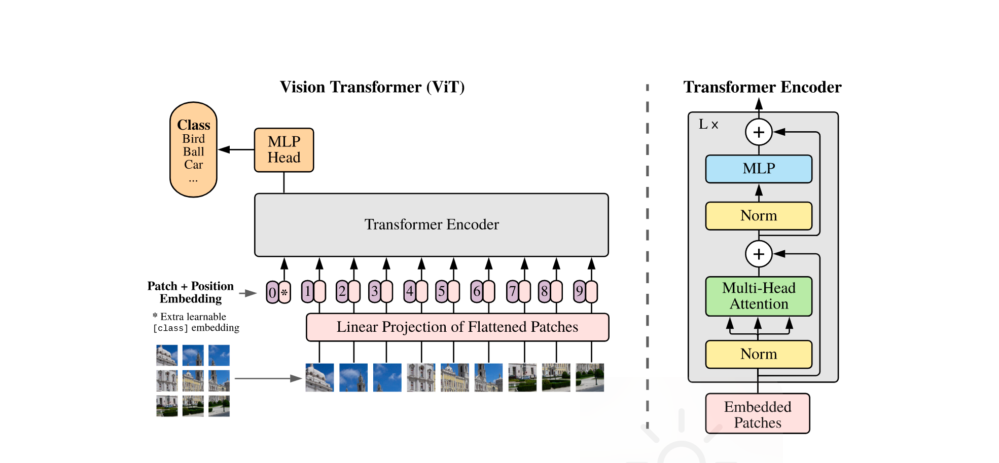

主要公式如下：

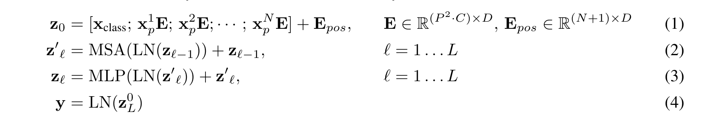

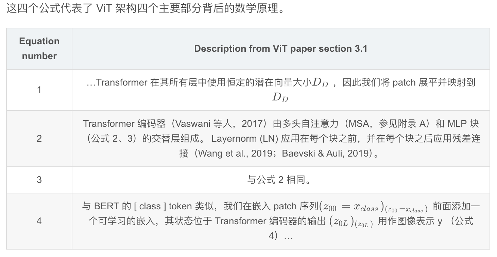

ViT 主要由以下几个阶段构成：

1. **Patch + Positional Embedding**：

将图像分割成固定大小的图块，然后将这些图块展平并添加位置编码。

原始的图片输入是一个大小为 $H \times W \times C$ 的图片，我们将其分割成 $N$ 个大小为 $P \times P \times C$ 的图块 **（`patch`）**，然后将这些图块展平成大小为 $N \times (P \times P \times C)$ 的向量序列。Transformer 每一层都使用 $D$ 维的嵌入，因此这输入的 $N \times (P \times P \times C)$ 的向量序列需要经过一个线性投影（图中 Linear Projection of Flattened Patches）将其**映射到 $D$ 维的向量序列**。（使用嵌入而不是直接使用原始像素值的原因是嵌入可以更好地捕捉图像的语义信息并且可学习）

与 `BERT` 的 `[class]` 标记类似，我们把 **`class token`** 加入到序列的开头，在此之后为了使 `Transformer` 能够感知到图像的全局位置信息，我们需要为每个位置添加**位置编码**，然后将位置编码加到每个位置的向量上，这样我们就得到了一个大小为 $(N+1) \times D$ 的向量序列。

> 在原文中使用的位置编码是通过可学习的参数来实现的，而
在 Attention is All You Need 中使用的是固定的位置编码。

2. **Transformer Encoder**：将向量序列输入到 `Transformer` 中。这部分结构类似原始的 `Transformer` 结构，最主要的部分是**多头自注意力机制（MSA）**，具体部分会在下一个模块详细介绍。

<p align="center">
  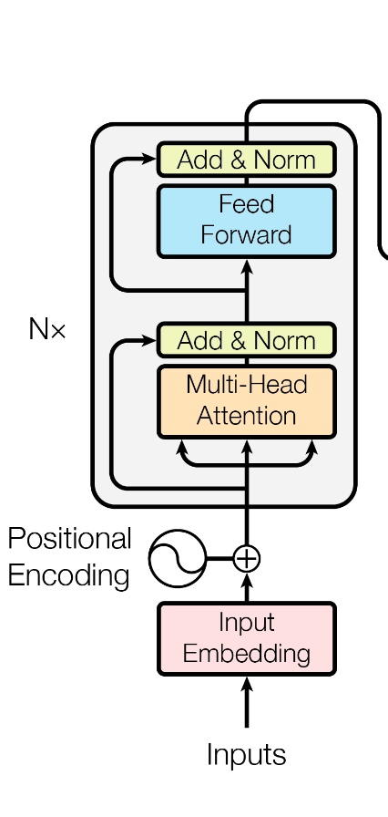
  V.S.
  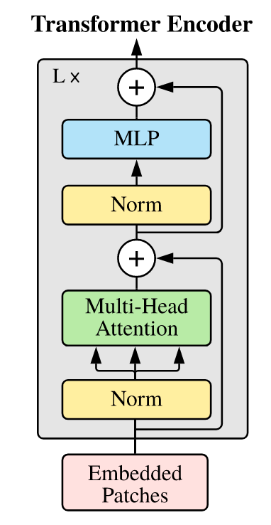
</p>

3. **MLP Head**：最后将 `Transformer` 的输出通过一个 `MLP` 层，然后通过一个线性层输出最终的分类结果。

## 3.2. 实验步骤

### 3.2.1 ViT 网络模块

#### 3.2.1.1 Patch + Positional Embedding

```python
class PatchEmbedded(nn.Module):
    def __init__(self, img_size=28, channels=1, patch_size=7, embed_dim=128):
        """
        img_size: 28
        channels: 1
        patch_size: 7
        """
        super().__init__()
        self.img_size = img_size
        self.channels = channels
        self.patch_size = patch_size
        self.embed_dim = embed_dim

        patch_dim = patch_size ** 2 * channels
        num_patches = (img_size // patch_size) ** 2

        self.embedding = nn.Linear(patch_dim, embed_dim)
        self.cls_token = nn.Parameter(torch.randn(1, 1, self.embed_dim))
        self.position_embedding = nn.Parameter(torch.randn(1, 1 + num_patches, embed_dim))

    def forward(self, x):
        x = rearrange(x, "b c (h h1) (w w1) -> b (h w) (c h1 w1)", h1=self.patch_size, w1=self.patch_size) # 分割成 n 个 patch
        x = self.embedding(x)  # b, n, d_model 线性投影
        cls_token = self.cls_token.expand(x.size(0), -1, -1)
        x = torch.cat((cls_token, x), dim=1)  # b, n+1, d_model
        x = x + self.position_embedding
        return x
```
这一部分在前面的模块已经有详细的讲解，不再赘述。

#### 3.2.1.2 Transformer Encoder


##### MSA

这部分主要对应了 Equation 2 的部分，`MultiHeadAttention` 模块的主要架构以及原理如下：

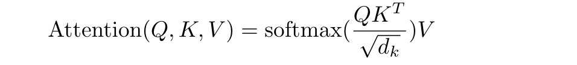

Attention 模块的主要架构以及原理如下：

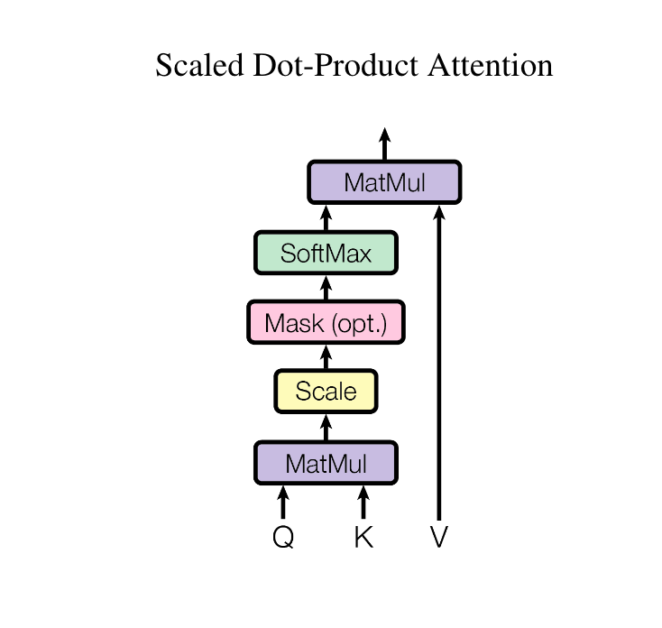

```python
def attention(query, key, value):  # 最后两个维度是长度与维度
    d_k = key.shape[-1]
    scores = torch.matmul(query, key.transpose(-2, -1))
    scores = scores / (d_k ** 0.5)
    return torch.matmul(F.softmax(scores, dim=-1), value)
```

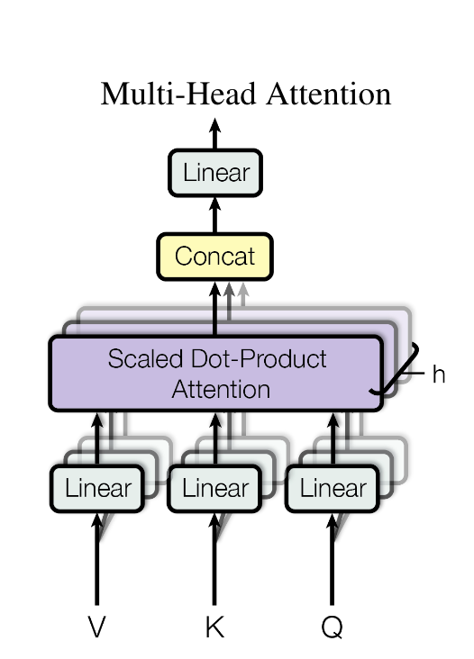

```python
class MultiHeadAttention(nn.Module):
    def __init__(self, d_model, num_heads):
        super().__init__()
        self.d_model = d_model
        self.num_heads = num_heads
        assert d_model % num_heads == 0
        self.d_k = d_model // num_heads

        self.w_query = nn.Linear(d_model, d_model)
        self.w_key = nn.Linear(d_model, d_model)
        self.w_value = nn.Linear(d_model, d_model)
        self.fc_out = nn.Linear(d_model, d_model)

    def forward(self, x):
        query = self.w_query(x)
        key = self.w_key(x)
        value = self.w_value(x)

        query = query.view(query.size(0), -1, self.num_heads, self.d_k).transpose(1, 2)
        key = key.view(key.size(0), -1, self.num_heads, self.d_k).transpose(1, 2)
        value = value.view(key.size(0), -1, self.num_heads, self.d_k).transpose(1, 2)

        atten = attention(query, key, value)  # b,h,len,d//h
        atten = atten.transpose(1, 2).contiguous().view(x.size(0), -1, self.num_heads * self.d_k)
        return self.fc_out(atten)  # b,h,d
```

##### MLP

这部分包含了 Equation 3 的部分，由线性层 - `GeLU` - `Dropout` - 线性层 - `Dropout` 组成。

```python
class MLPBlock(nn.Module):
    def __init__(self, d_model, d_liner, drop_prob):
        super().__init__()
        self.net = nn.Sequential(
            nn.Linear(d_model, d_liner),
            nn.GELU(),
            nn.Dropout(drop_prob),
            nn.Linear(d_liner, d_model),
            nn.Dropout(drop_prob)
        )
    def forward(self, x):
        return self.net(x)
```

##### Encoder Block

把 `MSA` 与 `MLP` 打包起来，加上了 `LayerNorm` 和残差连接。

```python
class EncoderBlock(nn.Module):
    def __init__(self, d_model, d_liner, num_heads, drop_prob):
        super().__init__()
        self.LayerNorm1 = nn.LayerNorm(d_model)
        self.atten = MultiHeadAttention(d_model, num_heads)
        self.drop_out2 = nn.Dropout(drop_prob)
        self.LayerNorm2 = nn.LayerNorm(d_model)
        self.mlp = MLPBlock(d_model, d_liner, drop_prob)
        self.drop_out1 = nn.Dropout(drop_prob)

    def forward(self, x):
        x = x + self.sub_layer1(x)  # MSA 部分与残差链接
        x = x + self.sub_layer2(x)  # MLP 部分与残差链接
        return x

    def sub_layer1(self, x):
        x = self.LayerNorm1(x)
        x = self.atten(x)
        x = self.drop_out1(x)
        return x

    def sub_layer2(self, x):
        x = self.LayerNorm2(x)
        x = self.mlp(x)
        x = self.drop_out2(x)
        return x
```
---

##### Transformer Encoder

把前面实现的 `EncoderBlock` 堆叠 ``num_blocks` 次。

```python
class TransformerEncoder(nn.Module):
    def __init__(self, num_blocks, d_model, d_liner, num_heads, drop_prob

):
        super().__init__()
        self.num_blocks = num_blocks
        self.layers = nn.ModuleList(
            [EncoderBlock(d_model, d_liner, num_heads, drop_prob) for _ in range(num_blocks)]
        )

    def forward(self, x):
        for layer in self.layers:
            x = layer(x)
        return x
```

#### 3.2.1.3 MLP Head

就是一个简单的线性层，把 `Transformer` 的输出映射到类别数，注意，这里的输出是一个序列，我们只需要 `cls token` 的输出，其维度为 `d_model`，因此这个线性层是 `d_model` 到类别数的映射。

#### 3.2.1.4 ViT 整体

```python
class ViT(nn.Module):
    def __init__(self, num_blocks, d_model, d_liner, num_heads, drop_prob, img_size, channels, patch_size, num_classes):
        super().__init__()
        self.patch_embedding = PatchEmbedded(img_size, channels, patch_size, d_model)
        self.dropout = nn.Dropout(drop_prob)
        self.encoder = TransformerEncoder(num_blocks, d_model, d_liner, num_heads, drop_prob)
        self.ln = nn.LayerNorm(d_model)
        self.mlp_head = nn.Linear(d_model, num_classes)  # MLP Head

    def forward(self, x):
        x = self.patch_embedding(x)
        x = self.dropout(x)
        x = self.encoder(x)
        x = self.ln(x)
        x = x[:, 0, :]  # 只取 cls token 的输出
        x = self.mlp_head(x)
        return x
```

### 3.3 训练与测试

#### 3.3.1 数据集准备

```python
def load_mnist(batch_size):
    # 定义数据转换
    transform = transforms.Compose([
        transforms.ToTensor(),
        transforms.Normalize((0.1307,), (0.3081,))
    ])

    # 下载训练数据与测试数据
    train_dataset = datasets.MNIST(root='./data', train=True, transform=transform, download=True)
    train_loader = DataLoader(train_dataset, batch_size=batch_size, shuffle=True)
    test_dataset = datasets.MNIST(root='./data', train=False, transform=transform, download=True)
    test_loader = DataLoader(test_dataset, batch_size=batch_size, shuffle=True)
    return train_loader, test_loader
```

#### 3.3.2 训练

```python
def train(model, device, train_loader, optimizer, criterion, epoch):
    model.train()
    for batch_idx, (data, target) in enumerate(train_loader):
        data, target = data.to(device), target.to(device)
        optimizer.zero_grad()
        output = model(data)
        loss = criterion(output, target)
        loss.backward()
        optimizer.step()
        if batch_idx % 100 == 0:
            print(f'Train Epoch: {epoch} [{batch_idx * len(data)}/{len(train_loader.dataset)} '
                  f'({100. * batch_idx / len(train_loader):.0f}%)]\tLoss: {loss.item():.6f}')
```

#### 3.3.3 测试

```python
def test(model, device, test_loader, criterion):
    model.eval()
    test_loss = 0
    correct = 0
    with torch.no_grad():
        for data, target in test_loader:
            data, target = data.to(device), target.to(device)
            output = model(data)
            test_loss += criterion(output, target).item()
            pred = output.argmax(dim=1, keepdim=True)
            correct += pred.eq(target.view_as(pred)).sum().item()

    test_loss /= len(test_loader.dataset)
    print(f'\nTest set: Average loss: {test_loss:.4f}, Accuracy: {correct}/{len(test_loader.dataset)} '
          f'({100. * correct / len(test_loader.dataset):.0f}%)\n')
    return test_loss
```

#### 3.3.4 `main` 函数

设置超参数，加载数据集，初始化模型、优化器、损失函数，然后开始训练和测试。我设置了学习率为 $0.001$，`batch_size` 为 $64$，训练 $50$ 轮次，`dropout` 为 $0.2$，模型嵌入维度为 $64$，线性层维度为 $128$，头数为 $8$，`patch` 大小为 $7$，最终的分类数为 $10$。
```python
def main():
    if torch.cuda.is_available():
        print("gpu")
    else: 
        print("cpu")    

    device = torch.device("cuda" if torch.cuda.is_available() else "cpu")
    epochs = 50
    lr = 0.001
    batch_size = 64
    # prepare datasets
    train_loader, test_loader = load_mnist(batch_size)
    
    num_blocks = 6
    d_model = 64
    d_liner = 128
    num_heads = 8
    drop_prob = 0.2
    img_size = 28
    channels = 1
    patch_size = 7
    num_classes = 10

    model = ViT(num_blocks, d_model, d_liner, num_heads, drop_prob, img_size, channels, patch_size, num_classes).to(device)
    optimizer = torch.optim.Adam(model.parameters(), lr=lr)
    criterion = nn.CrossEntropyLoss()

    best_loss = float('inf')
    best_model = None
    for epoch in range(epochs):
        train(model, device, train_loader, optimizer, criterion, epoch)
        loss = test(model, device, test_loader, criterion)
        if loss < best_loss:
            best_loss = loss
            best_model = model
    model_dir = "./model"
    if not os.path.exists(model_dir):
        os.makedirs(model_dir)

    torch.save(best_model.state_dict(), os.path.join(model_dir, "best_model.pth"))
```

## 3.4 实验结果

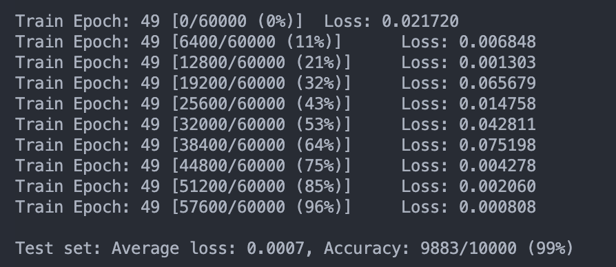

经过了 $50$ 轮次的训练，最终的测试集准确率达到了 $99\%$ 左右，可以看出 `ViT` 模型在 MNIST 数据集上的表现还是非常不错的。

# Part II: 基于 NumPy 实现

我们将代码开源到了 Github 上，链接为：[https://github.com/HorizonWind2004/mytorch](https://github.com/HorizonWind2004/mytorch).

## 1. mytorch 框架

我们希望通过此次试验，对 `PyTorch`框架的工作原理有更深入的理解，因此我们将手搓一个简化版的 `torch` 框架：**mytorch**。虽然 `torch` 的底层实现我们目前难以模仿，但我们通过模仿它的接口设计，在此次分类任务中，基本保证了用户可以在 `torch` 与 `mytorch` 之间无痛切换。

### 1.1 框架结构

```md
mytorch/
├── tensor.py
├── nn/
│   ├── module.py
│   ├── linear.py
│   ├── activation.py
│   ├── loss.py
│   ├── conv.py
│   ├── __init__.py
├── optim/
│   ├── optimizer.py
│   ├── __init__.py
├── __init__.py
```

### 1.2 张量 `Tensor`

我们实现了的深度学习框架中的核心类——`Tensor` 类。该类实现了基本的张量操作以及自动求导功能。下面将详细解释该类的设计、实现及其功能。

#### `Tensor` 类的设计与实现

##### 1. 类初始化与基本属性

```python
class Tensor:
    def __init__(self, data ,requires_grad = False):
        if isinstance(data, Tensor):
            self.data = data.data
            self.requires_grad = requires_grad or data.requires_grad
        else:
            self.data = np.array(data, dtype=np.float64)
            self.requires_grad = requires_grad
            
        self.grad = None
        self._backward = lambda: None
        self._prev = set()
```
- `data`：张量的数据，可以是另一个`Tensor`对象或可转换为NumPy数组的其他数据类型。
- `requires_grad`：布尔值，指示是否需要计算梯度。
- `grad`：存储梯度的张量，初始值为`None`。
- `_backward`：存储反向传播函数。
- `_prev`：存储计算图中前驱节点的集合。

##### 2. 自动求导功能

```python
    def backward(self):
        if self.grad is None:
            self.grad = np.ones_like(self.data)
        
        topo_order = []
        visited = set()

        def build_topo(v):
            if v not in visited:
                visited.add(v)
                for child in v._prev:
                    build_topo(child)
                topo_order.append(v)

        build_topo(self)

        for v in reversed(topo_order):
            v._backward()
```
- `backward` 方法实现了自动求导功能。首先，如果当前张量的 `grad` 属性为`None`，则初始化为全1张量。然后，通过拓扑排序算法，将计算图中所有节点按拓扑顺序排列。然后用深度优先搜索遍历计算图，对于每个节点，调用其 `_backward` 方法，该方法根据链式法则计算梯度。

##### 3. 基本运算符重载

- **加法**：

```python
    def __add__(self, other):
        
        if not isinstance(other, Tensor):
            other = Tensor(other)
            
        requires_grad = self.requires_grad or other.requires_grad
        out = Tensor(self.data + other.data , requires_grad = requires_grad)
        
        def _backward():
            # print('+')
            if self.requires_grad:
                if self.grad is None:
                    self.grad = out.grad
                else:
                    self.grad += out.grad
                    
            if other.requires_grad:
                grad = np.zeros_like(other.data)
                if other.data.shape != out.data.shape:
                    axis = tuple(range(out.grad.ndim - other.data.ndim))
                    grad += out.grad.sum(axis=axis)
                else:
                    grad += out.grad
                
                if other.grad is None:
                    other.grad = grad
                else:
                    other.grad += grad

        out._backward = _backward
        out._prev = {self, other}
        return out
    
```

直接将两个张量的 `data` 属性相加，并将 `requires_grad` 属性设置为两个张量中任意一个的 `requires_grad` 属性。反向传播函数根据链式法则计算梯度，不妨设损失函数为 $\mathcal L$ ，对于加法的部分显然有：

$$
\frac{\partial \mathcal L}{\partial x_0} = \frac{\partial \mathcal L}{\partial y} \frac{\partial y}{\partial x_0}
$$

其中：

$$
y = x_0 + x_1
$$

所以：

$$
\frac{\partial \mathcal L}{\partial x_0} = \frac{\partial \mathcal L}{\partial y} \frac{\partial y}{\partial x_0} = \frac{\partial \mathcal L}{\partial y}
$$ 

我们只需要将 $\frac{\partial \mathcal L}{\partial y}$ 加给 `self.grad` 属性即可，也就是将 `out.grad` 加给 `self.grad` 属性。


- **减法**：
```python
    def __sub__(self, other):
        
        if not isinstance(other,Tensor):
            other = Tensor(other)
        requires_grad = self.requires_grad or other.requires_grad
        out = Tensor(self.data - other.data , requires_grad = requires_grad)
        
        def _backward():
            # print('-')
            if self.requires_grad:
                if self.grad is None:
                    self.grad = out.grad
                else:
                    self.grad += out.grad
            if other.requires_grad:
                if other.grad is None:
                    other.grad = -out.grad
                else:
                    other.grad -= out.grad

        out._backward = _backward
        out._prev = {self, other}
        return out
```

减法和加法是同理的，这里不再赘述。

- **矩阵乘法**：
```python
    def __matmul__(self, other):
        
        assert isinstance(other, Tensor)
        requires_grad = self.requires_grad or other.requires_grad
        out = Tensor(self.data @ other.data , requires_grad = requires_grad)

        def _backward():
            # print('@')
            if self.requires_grad:
                if self.grad is None:
                    self.grad = out.grad @ other.data.T
                else:
                    self.grad += out.grad @ other.data.T
            if other.requires_grad:
                if other.grad is None:
                    other.grad = self.data.T @ out.grad
                else:
                    other.grad += self.data.T @ out.grad

        out._backward = _backward
        out._prev = {self, other}
        return out
```

同理，我们可以将两个张量的 `data` 属性相乘，并将 `requires_grad` 属性设置为两个张量中任意一个的 `requires_grad` 属性。反向传播函数根据链式法则计算梯度，不妨设损失函数为 $\mathcal L$ ，对于矩阵乘法的部分显然有：

$$
\frac{\partial \mathcal L}{\partial x_0} = \frac{\partial \mathcal L}{\partial y} \frac{\partial y}{\partial x_0} = \frac{\partial \mathcal L}{\partial y} \times x_1^T
$$

我们只需要将 $\frac{\partial \mathcal L}{\partial y} \times x_1^T$ 加给 `self.grad` 属性即可，也就是将 `out.grad` 乘以 `other.data.T` 加给 `self.grad` 属性。

- **乘法**：
```python
    def __mul__(self, other):
        
        if not isinstance(other, Tensor):
            Tensor(other)
        requires_grad = self.requires_grad or other.requires_grad
        out = Tensor(self.data * other.data , requires_grad = requires_grad)

        def _backward(): # we only consider the easiest case: z = x * y and x, y are independent.
            # print("mul")
            if self.requires_grad:
                if self.grad is None:
                    self.grad = out.grad * other.data
                else:
                    self.grad += out.grad * other.data
                    
            if other.requires_grad:
                if other.grad is None:
                    other.grad = out.grad * self.data
                else:
                    other.grad += out.grad * self.data

        out._backward = _backward
        out._prev = {self, other}
        return out

    def __rmul__(self, other):
        return self.__mul__(other)
```

同理，我们可以将两个张量的 `data` 属性相乘。反向传播函数根据链式法则计算梯度，不妨设损失函数为 $\mathcal L$ ，对于乘法的部分显然有：

$$
\frac{\partial \mathcal L}{\partial x_0} = \frac{\partial \mathcal L}{\partial y} \frac{\partial y}{\partial x_0} = \frac{\partial \mathcal L}{\partial y} \times x_1
$$

我们只需要将 $\frac{\partial \mathcal L}{\partial y} \times x_1$ 加给 `self.grad` 属性即可，也就是将 `out.grad` 乘以 `other.data` 加给 `self.grad` 属性。

我们还需要实现 `__rmul__` 方法，使得`x * y` 等价于 `y * x`。

- **负号**：
```python
    def __neg__(self):
        
        out = Tensor(-self.data, requires_grad = self.requires_grad)
    
        def _backward():
            # print("neg")
            if self.requires_grad:
                if self.grad is None:
                    self.grad = -out.grad
                else:
                    self.grad -= out.grad
    
        out._backward = _backward
        out._prev = {self}
        return out
```

这个部分相当简单，只需要将 `data` 属性取负即可，梯度的部分也是直接取负。

- **幂运算**：
```python
    def __pow__(self, power):
        
        out = Tensor(self.data ** power, requires_grad = self.requires_grad)

        def _backward():
            # print("**")
            if self.requires_grad:
                if self.grad is None:
                    self.grad = out.grad * (power * (self.data ** (power-1)))
                else:
                    self.grad += out.grad * (power * (self.data ** (power-1)))

        out._backward = _backward
        out._prev = {self}
        return out
```

只需要计算 `data` 属性的幂即可，梯度的部分根据公式，我们可以计算得到：


$$
\frac{\partial \mathcal L}{\partial x_0} = \frac{\partial \mathcal L}{\partial y} \frac{\partial y}{\partial x_0} = \frac{\partial \mathcal L}{\partial y} \times x_0^{\text{power}-1}\cdot \text{power}
$$

我们只需要将 $\frac{\partial \mathcal L}{\partial y} \times x_0^{\text{power}-1}\cdot \text{power}$ 加给 `self.grad` 属性即可，也就是将 `out.grad` 乘以 `power * (self.data ** (power-1))` 加给 `self.grad` 属性。


##### 4. 常用函数
- **ReLU**：
```python
def relu(self):
    out = Tensor(np.maximum(0, self.data), requires_grad=self.requires_grad)

    def _backward():
        if self.requires_grad:
            self.grad = (self.grad or 0) + out.grad * (self.data > 0)

    out._backward = _backward
    out._prev = {self}
    return out
```

反向传播函数根据链式法则计算梯度，不妨设损失函数为 $\mathcal L$ ，对于 ReLU 函数的部分显然有：

$$
\frac{\partial \mathcal L}{\partial x_0} = \frac{\partial \mathcal L}{\partial y} \frac{\partial y}{\partial x_0} = \frac{\partial \mathcal L}{\partial y} \times (x_0 > 0)
$$

我们只需要将 $\frac{\partial \mathcal L}{\partial y} \times (x_0 > 0)$ 加给 `self.grad` 属性即可，也就是将 `out.grad` 乘以 `(self.data > 0)` 加给 `self.grad` 属性。

- **均值**：

```python
    def mean(self):
        
        out = Tensor(self.data.mean(), requires_grad=self.requires_grad)

        def _backward():
            # print("mean")
            if self.requires_grad:
                grad = np.ones_like(self.data) / self.data.size
                if self.grad is None:
                    self.grad = grad * out.grad
                else:
                    self.grad += grad * out.grad

        out._backward = _backward
        out._prev = {self}
        return out
```

反向传播函数根据链式法则计算梯度，不妨设损失函数为 $\mathcal L$ ，对于均值函数的部分显然有：

$$
\frac{\partial \mathcal L}{\partial x_0} = \frac{\partial \mathcal L}{\partial y} \frac{\partial y}{\partial x_0} = \frac{\partial \mathcal L}{\partial y} \times \frac{1}{n}
$$

我们只需要将 $\frac{\partial \mathcal L}{\partial y} \times \frac{1}{n}$ 加给 `self.grad` 属性即可，也就是将 `out.grad` 乘以 `1/self.data.size` 加给 `self.grad` 属性。

- **`view`**：

```python
    def view(self, *shape):
        
        out = Tensor(self.data.reshape(*shape), requires_grad=self.requires_grad)
        
        def _backward():
            # print("view")
            if self.requires_grad:
                grad = out.grad.reshape(self.data.shape)
                self.grad = grad
                    
            # print(self.grad)
    
        out._backward = _backward
        out._prev = {self}
        return out
```

反向传播函数根据链式法则计算梯度，不妨设损失函数为 $\mathcal L$ ，则 `view` 函数的梯度就是对原张量的梯度进行一次 `view` 操作，计算如下：

$$
\frac{\partial \mathcal L}{\partial x_0} = \frac{\partial \mathcal L}{\partial y} \frac{\partial y}{\partial x_0} = (\frac{\partial \mathcal L}{\partial y}).\text{view}(x_0.\text{shape})
$$

我们只需要将 `out.grad` 改变形状后加给 `self.grad` 属性即可。

- **`sigmoid`**：

```python
    def sigmoid(self):
        out = Tensor(1/(1 + np.exp(-self.data)), requires_grad=self.requires_grad)
    
        def _backward():
            # print("sigmoid")
            if self.requires_grad:
                grad = out.data * (1 - out.data)
                if self.grad is None:
                    self.grad = grad * out.grad
                else:
                    self.grad += grad * out.grad
    
        out._backward = _backward
        out._prev = {self}
        return out
```

反向传播函数根据链式法则计算梯度，不妨设损失函数为 $\mathcal L$ ，则 `sigmoid` 函数的梯度就是 `sigmoid` 函数的导数，计算如下：

$$
\frac{\partial \mathcal L}{\partial x_0} = \frac{\partial \mathcal L}{\partial y} \frac{\partial y}{\partial x_0} = \frac{\partial \mathcal L}{\partial y} \times \sigma(x_0) \times (1 - \sigma(x_0))
$$

我们只需要将 $\frac{\partial \mathcal L}{\partial y} \times \sigma(x_0) \times (1 - \sigma(x_0))$ 加给 `self.grad` 属性即可，也就是将 `out.grad` 乘以 `out.data * (1 - out.data)` 加给 `self.grad` 属性。

##### 5. 其他

下面这些操作比较简单，且与张量的基本运算无关，因此不再赘述。

- **字符串表示**：

```python
def __repr__(self):
    return f"Tensor(\ndata = \n{self.data},\nrequires_grad = {self.requires_grad}\n)"
```

- **长度**：

```python
def __len__(self):
    return len(self.data)
```

- **索引**：

```python
def __getitem__(self, idx):
    return Tensor(self.data[idx], requires_grad=self.requires_grad)
```

### 1.3 nn 模块

`nn` 模块是 `PyTorch` 中用于构建神经网络的模块，其主要包含以下内容：

- `Module`：一个抽象类，用于实现神经网络的层。
- `Linear`：一个线性层，用于实现线性变换。
- `Parameter`：一个类，用于实现参数。
- `ReLU`：一个激活函数，用于实现 ReLU 激活函数。
- `MSELoss`：一个损失函数，用于实现均方误差损失函数。
- `Conv2d`：一个卷积层，用于实现二维卷积。
- `CrossEntropyLoss`：一个损失函数，用于实现交叉熵损失函数。
- `AvgPool2d`：一个池化层，用于实现平均池化。
- `BatchNorm2d`：一个批标准化层，用于实现批标准化。
- `sigmoid`：一个激活函数，用于实现 sigmoid 激活函数。

下面我们将分文件介绍 `nn` 模块的实现。

#### 1.3.1 `module.py`

`Module` 是一个抽象类，用于实现神经网络的层。

##### 类的初始化与基本属性

```python
class Module:
    def __init__(self):
        self._parameters = {}
        self._modules = {}
```

`Module` 类初始化时，会初始化两个字典：`_parameters` 和 `_modules`。`_parameters` 用于保存模型的参数，`_modules` 用于保存子模块。

##### 基本函数重写

- **``__setattr__``**：
```python
    def __setattr__(self, name, value):
        if isinstance(value, Tensor):
            self._parameters[name] = value
        elif isinstance(value, Module):
            self._modules[name] = value
        super().__setattr__(name, value)
```

`Module` 类重写了 `__setattr__` 方法，用于设置属性。当设置的属性是 `Tensor` 类型时，会将其添加到 `_parameters` 字典中；当设置的属性是 `Module` 类型时，会将其添加到 `_modules` 字典中。这样可以方便轻松地管理模型的参数和子模块。

- **``__call__``**：
```python
    def __call__(self, *inputs):
        return self.forward(*inputs)
```

`Module` 类重写了 `__call__` 方法，用于实现模型的前向传播。模型中我们只需要复写 `forward` 方法即可。

##### 其余功能的实现

- **``parameters``**：
```python
    def parameters(self):
        for name, param in self._parameters.items():
            yield param
        for name, module in self._modules.items():
            yield from module.parameters()
```


`parameters` 方法用于返回模型的所有参数。

- **``forward``**：
```python
    def forward(self, *inputs):
        raise NotImplementedError
```

`forward` 方法是一个抽象方法，需要在子类中实现。


- **``children``**：
```python
    def children(self):
        for name, module in self._modules.items():
            yield module
```

`children` 方法用于返回模型的所有子模块。

- **``state_dict``**：
```python
    def state_dict(self):
        state_dict = {}
        for name, module in self._modules.items():
            state_dict[name] = module.state_dict()
        for name, param in self._parameters.items():
            state_dict[name] = param.data
        return state_dict
```

`state_dict` 方法用于返回模型的参数字典。

- **``load_state_dict``**：
```python
    def load_state_dict(self, state_dict):
        for name, obj in state_dict.items():
            if isinstance(obj, numpy.ndarray):
                self._parameters[name].data = obj
                # print(f'Loading parameter {name}')
            else:
                self._modules[name].load_state_dict(obj)
```

`load_state_dict` 方法用于加载模型的参数字典。这主要是用来加载保存的模型参数。

- **``save``**：
```python
    def save(self, path):
        state_dict = self.state_dict()
        with open(path, 'wb') as f:
            pickle.dump(state_dict, f)
```

`save` 方法用于保存模型的参数字典。我们选用的是 `python` 的 `pickle` 库，将参数字典保存为 `.pkl` 文件。

- **``train``**：
```python
    def train(self):
        for module in self.children():
            if hasattr(module, 'train'):
                module.train()
```

`train` 方法用于设置模型为训练模式。这主要是在 `BatchNorm2d` 层中使用。

- **``eval``**：
```python
    def eval(self):
        for module in self.children():
            if hasattr(module, 'eval'):
                module.eval()
```

`eval` 方法用于设置模型为评估模式。

#### 1.3.2 linear.py

`Linear` 是一个线性层，用于实现线性变换。

##### nn.Linear

```python
class Linear(Module):
    def __init__(self, in_features, out_features):
        super(Linear,self).__init__()
        # self.weight = Parameter(Tensor(np.zeros((in_features, out_features))))
        self.weight = Parameter(Tensor(np.random.randn(in_features, out_features)*0.01))
        self.bias = Parameter(Tensor(np.zeros(out_features)))

    def forward(self, x):
        return x @ self.weight + self.bias
```

`Linear` 类继承自 `Module` 类，实现了线性层的前向传播。我们选用的初始化方法是简单的随机初始化，即将权重初始化为服从正态分布的随机数 $\times 0.01$，将偏置初始化为全零。

##### nn.Parameter

```python
class Parameter(Tensor):
    def __init__(self, data):
      super().__init__(data, requires_grad = True)
```

`Parameter` 类继承自 `Tensor` 类，实现了参数的初始化。

#### 1.3.3 activation.py

```python
import numpy as np
from .module import Module
from mytorch.tensor import Tensor

class ReLU(Module):
    def forward(self, x):
        return x.relu()
    
class sigmoid(Module):
    def forward(self, x):
        return x.sigmoid()
    
class SimpleSoftmax(Module): # 废弃
    def forward(self, x):
        return x.softmax()
```

`activation` 模块的实现相当简单，只需要调用 `Tensor` 类中的 `relu` 和 `sigmoid` 方法即可。多一层包装只是为了和 `PyTorch` 的接口保持一致。

#### 1.3.4 loss.py

```python
import numpy as np
from .module import Module
from mytorch.tensor import Tensor

class MSELoss(Module):
    def forward(self, prediction, target):
        return ((prediction - target) ** 2).mean()

class CrossEntropyLoss(Module):
    def forward(self, prediction, target):
        exps = np.exp(prediction.data - np.max(prediction.data, axis=-1, keepdims=True))
        probs = exps / np.sum(exps, axis=-1, keepdims=True)
        N = prediction.data.shape[0]
        self.data = -np.sum(target.data * np.log(probs + 1e-12)) / N
        self.probs = probs
        self.prediction = prediction
        self.target = target
        return self

    def backward(self):
        if self.prediction.requires_grad:
            N = self.prediction.data.shape[0]
            grad = (self.probs - self.target.data) / N
            if self.prediction.grad is None:
                self.prediction.grad = grad
            else:
                self.prediction.grad += grad
            self.prediction.backward()
```

`MSELoss` 类实现了均方误差损失函数，比较简单，`CrossEntropyLoss` 类实现了交叉熵损失函数，需要实现 `backward` 方法。为了防止出现精度错误，我们的写法比较粗暴，将 `softmax` 和 `ln` 一起写在了 `forward` 方法中，并且一起实现反向传播。具体原因可以在后续「遇到的困难」章节中查看。

求导结果比较复杂，这里简单写出结论：

$$
\frac{\partial \mathcal L}{\partial x} = \frac{\partial \mathcal L}{\partial y} \frac{\partial y}{\partial x} = \frac{\partial \mathcal L}{\partial y} \times \frac{1}{N} \times (\text{probs} - \text{target})
$$

#### 1.3.5 conv2d.py

##### nn.Conv2d

- **初始化**：
```python
def __init__(self, in_channels, out_channels, kernel_size, stride=1, padding=0):
        super(Conv2d, self).__init__()
        self.in_channels = in_channels
        self.out_channels = out_channels
        self.kernel_size = kernel_size if isinstance(kernel_size, tuple) else (kernel_size, kernel_size)
        self.stride = stride if isinstance(stride, tuple) else (stride, stride)
        self.padding = padding if isinstance(padding, tuple) else (padding, padding)

        # He initialization
        stddev = np.sqrt(2 / (in_channels * self.kernel_size[0] * self.kernel_size[1]))
        self.weight = Parameter(Tensor(np.random.randn(out_channels, in_channels, *self.kernel_size) * stddev))
        self.bias = Parameter(Tensor(np.zeros(out_channels)))
```

`Conv2d` 类继承自 `Module` 类，实现了二维卷积层的初始化。我们选用了 $\text{Kaiming}$
 初始化方法，即将权重初始化为服从正态分布的随机数乘以 $\sqrt{\frac{2}{\text{in\_channels} \times \text{kernel\_size}_0 \times \text{kernel\_size}_1}}$，将偏置初始化为全零。

- **前向传播**：
```python
    def forward(self, x):
        batch_size, _, height, width = x.data.shape

        out_height = ((height + 2 * self.padding[0] - self.kernel_size[0]) // self.stride[0]) + 1
        out_width = ((width + 2 * self.padding[1] - self.kernel_size[1]) // self.stride[1]) + 1

        out = Tensor(np.zeros((batch_size, self.out_channels, out_height, out_width)), requires_grad=x.requires_grad)

        x_padded = np.pad(x.data, [(0, 0), (0, 0), (self.padding[0], self.padding[0]), (self.padding[1], self.padding[1])], mode='constant')

        # Perform convolution
        for i in range(out_height):
            for j in range(out_width):
                h_start = i * self.stride[0]
                w_start = j * self.stride[1]
                h_end = h_start + self.kernel_size[0]
                w_end = w_start + self.kernel_size[1]
                region = x_padded[:, :, h_start:h_end, w_start:w_end]
                out.data[:, :, i, j] = np.tensordot(region, self.weight.data, axes=([1, 2, 3], [1, 2, 3]))

        out.data += self.bias.data.reshape(1, -1, 1, 1)

        def _backward():
            if x.requires_grad:
                dx_padded = np.zeros_like(x_padded)
                for i in range(out_height):
                    for j in range(out_width):
                        h_start = i * self.stride[0]
                        w_start = j * self.stride[1]
                        h_end = h_start + self.kernel_size[0]
                        w_end = w_start + self.kernel_size[1]
                        np.add.at(dx_padded, (slice(None), slice(None), slice(h_start, h_end), slice(w_start, w_end)),
                                  np.tensordot(out.grad[:, :, i, j], self.weight.data, axes=(1, 0)))
                x.grad = dx_padded[:, :, self.padding[0]:-self.padding[0], self.padding[1]:-self.padding[1]] if self.padding != (0, 0) else dx_padded

            if self.weight.requires_grad:
                dweight = np.zeros_like(self.weight.data)
                for i in range(out_height):
                    for j in range(out_width):
                        h_start = i * self.stride[0]
                        w_start = j * self.stride[1]
                        h_end = h_start + self.kernel_size[0]
                        w_end = w_start + self.kernel_size[1]
                        region = x_padded[:, :, h_start:h_end, w_start:w_end]
                        dweight += np.tensordot(out.grad[:, :, i, j], region, axes=([0], [0]))
                self.weight.grad = dweight

            if self.bias.requires_grad:
                self.bias.grad = out.grad.sum(axis=(0, 2, 3))

        out._backward = _backward
        out._prev = {x}
            
        return out
```


考虑一个输入张量 `X`，卷积核 `W`，以及卷积操作的输出 `Y`。假设输入张量的形状为 `(N, C, H, W)`，卷积核的形状为 `(F, C, K, K)`，输出张量的形状为 `(N, F, H_out, W_out)`。

其中：
- `N`：批量大小
- `C`：输入通道数
- `H`、`W`：输入的高度和宽度
- `F`：卷积核的数量（输出通道数）
- `K`：卷积核的高度和宽度（假设卷积核是正方形）
- `H_out`、`W_out`：输出的高度和宽度，通常由输入大小、卷积核大小、步幅和填充决定

卷积操作的前向传播公式可以表示为：

$$
Y_{n, f, i, j} = \sum_{c=0}^{C-1} \sum_{u=0}^{K-1} \sum_{v=0}^{K-1} X_{n, c, i+u, j+v} \cdot W_{f, c, u, v}
$$


对于卷积核 `W` 的梯度，我们使用链式法则进行计算：

\[ \frac{\partial \mathcal L}{\partial W_{f, c, u, v}} = \sum_{n=0}^{N-1} \sum_{i=0}^{H_{out}-1} \sum_{j=0}^{W_{out}-1} \frac{\partial \mathcal L}{\partial Y_{n, f, i, j}} \cdot \frac{\partial Y_{n, f, i, j}}{\partial W_{f, c, u, v}} \]

\[ \frac{\partial Y_{n, f, i, j}}{\partial W_{f, c, u, v}} = X_{n, c, i+u, j+v} \]

因此：

\[ \frac{\partial\mathcal L}{\partial W_{f, c, u, v}} = \sum_{n=0}^{N-1} \sum_{i=0}^{H_{out}-1} \sum_{j=0}^{W_{out}-1} \frac{\partial\mathcal L}{\partial Y_{n, f, i, j}} \cdot X_{n, c, i+u, j+v} \]

对于输入 `X` 的梯度，同样使用链式法则进行计算：

\[ \frac{\partial\mathcal L}{\partial X_{n, c, i, j}} = \sum_{f=0}^{F-1} \sum_{u=0}^{K-1} \sum_{v=0}^{K-1} \frac{\partial\mathcal L}{\partial Y_{n, f, i-u, j-v}} \cdot \frac{\partial Y_{n, f, i-u, j-v}}{\partial X_{n, c, i, j}} \]

\[ \frac{\partial Y_{n, f, i-u, j-v}}{\partial X_{n, c, i, j}} = W_{f, c, u, v} \]

因此：

\[ \frac{\partial\mathcal L}{\partial X_{n, c, i, j}} = \sum_{f=0}^{F-1} \sum_{u=0}^{K-1} \sum_{v=0}^{K-1} \frac{\partial\mathcal L}{\partial Y_{n, f, i-u, j-v}} \cdot W_{f, c, u, v} \]

注意：在计算过程中，我们需要考虑边界条件，即当 \(i-u\) 或 \(j-v\) 超出范围时， \(\frac{\partial\mathcal L}{\partial Y_{n, f, i-u, j-v}}\) 应该被视为零。

##### nn.AvgPool2d

- **初始化**：

```python
class AvgPool2d(Module):
    def __init__(self, kernel_size, stride=None):
        super(AvgPool2d, self).__init__()
        self.kernel_size = kernel_size if isinstance(kernel_size, tuple) else (kernel_size, kernel_size)
        self.stride = stride if stride is not None else self.kernel_size
```

`AvgPool2d` 类继承自 `Module` 类，实现了平均池化层的初始化。


- **前向传播**：
```python
    def forward(self, x):
        batch_size, num_channels, height, width = x.data.shape
        
        out_height = ((height - self.kernel_size[0]) // self.stride[0]) + 1
        out_width = ((width - self.kernel_size[1]) // self.stride[1]) + 1

        out = Tensor(np.zeros((batch_size, num_channels, out_height, out_width)), requires_grad=x.requires_grad)
                
        for i in range(out_height):
            for j in range(out_width):
                h_start = i * self.stride[0]
                w_start = j * self.stride[1]
                h_end = h_start + self.kernel_size[0]
                w_end = w_start + self.kernel_size[1]
                region = x.data[:, :, h_start:h_end, w_start:w_end]
                out.data[:, :, i, j] = np.mean(region, axis=(2, 3))
        
        def _backward():
            dx = np.zeros_like(x.data)
            area = self.kernel_size[0] * self.kernel_size[1] 
            for i in range(out_height):
                for j in range(out_width):
                    h_start = i * self.stride[0]
                    w_start = j * self.stride[1]
                    h_end = h_start + self.kernel_size[0]
                    w_end = w_start + self.kernel_size[1]
                    dx[:, :, h_start:h_end, w_start:w_end] += (out.grad[:, :, i, j] / area).reshape(batch_size, num_channels, 1, 1)
                
                x.grad = dx

        out._backward = _backward
        out._prev = {x}
        return out
```


同理有

\[ \frac{\partial \mathcal L}{\partial X_{n, c, i, j}} = \frac{1}{K \times K} \sum_{p=0}^{H_{out}-1} \sum_{q=0}^{W_{out}-1} \delta(i \in [p \times S, p \times S + K)) \cdot \delta(j \in [q \times S, q \times S + K)) \cdot \frac{\partial\mathcal L}{\partial Y_{n, c, p, q}} \]

其中，

$\delta(x) = \begin{cases} 1, & \text{if } x \text{ is true} \\ 0, & \text{otherwise} \end{cases}$

##### nn.BatchNorm2d

- **初始化**：
```python
class BatchNorm2d(Module):
    def __init__(self, num_features, eps=1e-5, momentum=0.1):
        super(BatchNorm2d, self).__init__()
        self.num_features = num_features
        self.eps = eps
        self.momentum = momentum
        self.gamma = Parameter(Tensor(np.ones(num_features)))
        self.beta = Parameter(Tensor(np.zeros(num_features)))
        self.running_mean = Parameter(Tensor(np.zeros(num_features)))
        self.running_var = Parameter(Tensor(np.ones(num_features)))
        self.training = False
```

`BatchNorm2d` 类继承自 `Module` 类，实现了批量归一化层的初始化。其中 `gamma` 和 `beta` 是可学习的参数，`running_mean` 和 `running_var` 是不可学习的参数，用于保存训练过程中的均值和方差。

- **前向传播**：
```python
    def forward(self, x):
        if self.training:
            mean = x.data.mean(axis=(0, 2, 3), keepdims=True)
            var = x.data.var(axis=(0, 2, 3), keepdims=True) + self.eps
            self.running_mean.data = self.momentum * self.running_mean.data + (1 - self.momentum) * mean.flatten()
            self.running_var.data = self.momentum * self.running_var.data + (1 - self.momentum) * var.flatten()
            x_normalized = (x.data - mean) / np.sqrt(var)
        else:
            mean = self.running_mean.data.reshape(1, self.num_features, 1, 1)
            var = self.running_var.data.reshape(1, self.num_features, 1, 1)
            x_normalized = (x.data - mean) / np.sqrt(var + self.eps)

        gamma_reshaped = self.gamma.data.reshape(1, self.num_features, 1, 1)
        beta_reshaped = self.beta.data.reshape(1, self.num_features, 1, 1)

        out = Tensor(gamma_reshaped * x_normalized + beta_reshaped, requires_grad=x.requires_grad)

        def _backward():
            if x.requires_grad:
                grad_x_normalized = out.grad * self.gamma.data.reshape(1, self.num_features, 1, 1)
                std_var_inv = 1. / np.sqrt(var)
                dx = grad_x_normalized * std_var_inv

                grad_gamma = np.sum(grad_x_normalized * x_normalized, axis=(0, 2, 3))
                grad_beta = np.sum(out.grad, axis=(0, 2, 3))

                self.gamma.grad = grad_gamma
                self.beta.grad = grad_beta
                x.grad = dx

        out._backward = _backward
        out._prev = {x}

        return out

    def train(self):
        self.training = True

    def eval(self):
        self.training = False
```

Batch Normalization 的前向传播包括以下步骤：

- **计算批量均值和方差**：
   对每个通道计算输入的均值和方差。
   
   \[
   \mu_c = \frac{1}{N \cdot H \cdot W} \sum_{n=1}^N \sum_{i=1}^H \sum_{j=1}^W X_{n,c,i,j}
   \]
   
   \[
   \sigma_c^2 = \frac{1}{N \cdot H \cdot W} \sum_{n=1}^N \sum_{i=1}^H \sum_{j=1}^W (X_{n,c,i,j} - \mu_c)^2
   \]

- **归一化**：
   使用计算得到的均值和方差对输入进行归一化。
   
   \[
   \hat{X}_{n,c,i,j} = \frac{X_{n,c,i,j} - \mu_c}{\sqrt{\sigma_c^2 + \epsilon}}
   \]

   其中，\(\epsilon\) 是一个很小的数，用于防止除零。

- **缩放和平移**：
   通过可学习的参数 γ 和 β 对归一化的结果进行缩放和平移。
   
   \[
   Y_{n,c,i,j} = \gamma_c \hat{X}_{n,c,i,j} + \beta_c
   \]


反向传播过程需要计算损失函数相对于输入 \( X \)、均值 \(\mu\)、方差 \(\sigma^2\)、缩放参数 \(\gamma\) 和平移参数 \(\beta\) 的梯度。

1. **计算相对于输出 \(Y\) 的梯度**：
   
   \[
   \frac{\partial\mathcal L}{\partial Y_{n,c,i,j}}
   \]

2. **计算相对于 \(\gamma\) 和 \(\beta\) 的梯度**：
   
   \[
   \frac{\partial\mathcal L}{\partial \gamma_c} = \sum_{n=1}^N \sum_{i=1}^H \sum_{j=1}^W \frac{\partial\mathcal L}{\partial Y_{n,c,i,j}} \cdot \hat{X}_{n,c,i,j}
   \]
   
   \[
   \frac{\partial\mathcal L}{\partial \beta_c} = \sum_{n=1}^N \sum_{i=1}^H \sum_{j=1}^W \frac{\partial\mathcal L}{\partial Y_{n,c,i,j}}
   \]

3. **计算相对于 \(\hat{X}\) 的梯度**：
   
   \[
   \frac{\partial\mathcal L}{\partial \hat{X}_{n,c,i,j}} = \frac{\partial\mathcal L}{\partial Y_{n,c,i,j}} \cdot \gamma_c
   \]

4. **计算相对于输入 \(X\) 的梯度**：
   
    \[
    \frac{\partial\mathcal L}{\partial X_{n,c,i,j}} = \frac{\partial\mathcal L}{\partial \hat{X}_{n,c,i,j}} \cdot \frac{1}{\sqrt{\sigma_c^2 + \epsilon}}
    \]

### 1.4 optim 模块

#### optim.SGD

我们的 `SGD` 加入了动量（`momentum`）和权重衰减（`weight decay`）技术。

##### 初始化

```python
class SGD:
    def __init__(self, parameters, lr=0.01, momentum=0.9, weight_decay=0.0005):
        self.parameters = list(parameters)
        self.lr = lr
        self.momentum = momentum
        self.velocities = [np.zeros_like(param.data) for param in self.parameters]
        self.weight_decay = weight_decay
```

- `parameters`：需要优化的模型参数（权重），通常是 `Tensor` 对象的列表。
- `lr`：学习率，控制每次更新的步长大小，默认为 $0.01$。
- `momentum`：动量因子，用于加速收敛和避免局部最优解，默认为 $0.9$。
- `weight_decay`：权重衰减因子，防止过拟合，通过在更新时减去参数值的一个比例来实现，默认为 $0.0005$。其实这个就是 $L2$ 正则化的体现——在损失函数中加入权重的平方和，来约束权重的大小。

##### `step`

```python
def step(self):
    for i, param in enumerate(self.parameters):
        if param.requires_grad and param.grad is not None:
            self.velocities[i] = self.momentum * self.velocities[i] + self.lr * param.grad
            param.data -= self.weight_decay * param.data
            param.data -= self.velocities[i]
```

遍历每个参数 `param`，并检查其是否需要梯度更新（`requires_grad` 为 True）且梯度不为 None。

- 动量更新公式：

\[ v_t = \mu v_{t-1} + \eta g_t \]

其中，\( \mu \) 是动量因子，\( \eta \) 是学习率，\( g_t \) 是当前的梯度。

- 更新动量：`self.velocities[i] = self.momentum * self.velocities[i] + self.lr * param.grad`

- 权重衰减：`param.data -= self.weight_decay * param.data`。

- 更新参数值：`param.data -= self.velocities[i]`

##### `zero_grad` 

```python
def zero_grad(self):
    for param in self.parameters:
        if param.requires_grad:
            param.grad = np.zeros_like(param.data)
```

将所有参数的梯度置零。

### 1.5 加载 `.pkl`  模型，加载数据集相关方法

这些方法比较简单，放在 `mytorch/__init__.py` 文件中。

```python
def load(path):
    with open(path, 'rb') as f:
        state_dict = pickle.load(f)
        return state_dict
    
def read_images(filename):
    with open(filename, 'rb') as f:
        magic = int.from_bytes(f.read(4), 'big')
        num = int.from_bytes(f.read(4), 'big')
        rows = int.from_bytes(f.read(4), 'big')
        cols = int.from_bytes(f.read(4), 'big')
        images = np.frombuffer(f.read(), dtype=np.uint8).reshape(num, rows, cols)
    return images

def read_labels(filename):
    with open(filename, 'rb') as f:
        magic = int.from_bytes(f.read(4), 'big')
        num = int.from_bytes(f.read(4), 'big')
        labels = np.frombuffer(f.read(), dtype=np.uint8)
    return labels

def load_mnist(data_dir):
    train_images = read_images(os.path.join(data_dir, 'train-images-idx3-ubyte'))
    train_labels = read_labels(os.path.join(data_dir, 'train-labels-idx1-ubyte'))
    test_images = read_images(os.path.join(data_dir, 't10k-images-idx3-ubyte'))
    test_labels = read_labels(os.path.join(data_dir, 't10k-labels-idx1-ubyte'))
    
    return (train_images, train_labels), (test_images, test_labels)
```

## 2. 实现 MNIST 分类任务

### 2.1 模型架构

我们选用了两种架构，一种是简单的全连接神经网络，用于快速验证代码的正确性；另一种是 LeNet，用于实际的训练和测试。不选用 Resnet 或者 VGG 的原因是，在 MNIST 任务上 LeNet 已经足够好了，而且 Resnet 和 VGG 参数量大，不适合 CPU 训练。

全连接神经网络的架构如下：

```python
class FCN(Module):
    def __init__(self):
        super(FCN, self).__init__()
        self.fc1 = Linear(28 * 28, 128)
        self.relu1 = ReLU()
        self.fc2 = Linear(128, 64)
        self.relu2 = ReLU()
        self.fc3 = Linear(64, 10)

    def forward(self, x):
        x = x.view(x.data.shape[0], 28 * 28)
        x = self.fc1(x)
        x = self.relu1(x)
        x = self.fc2(x)
        x = self.relu2(x)
        x = self.fc3(x)
        return x
```

是一个有两个隐藏层的全连接神经网络，隐藏层的激活函数为 $\text{ReLU}$。

LeNet 的架构如下：

```python
class LeNet(Module):
    def __init__(self):
        super(LeNet, self).__init__()
        self.conv1 = Conv2d(1, 6, kernel_size=5, padding=2)
        self.norm1 = BatchNorm2d(6)
        self.relu1 = ReLU()
        self.conv2 = Conv2d(6, 16, kernel_size=5) 
        self.norm2 = BatchNorm2d(16)
        self.relu2 = ReLU()
        self.fc1 = Linear(16 * 5 * 5, 120)
        self.relu3 = ReLU()
        self.fc2 = Linear(120, 84)
        self.relu4 = ReLU()
        self.fc3 = Linear(84, 10)

    def forward(self, x):
        x = self.conv1(x)
        x = self.norm1(x)
        x = self.relu1(x)
        x = AvgPool2d(kernel_size=2)(x)
        x = self.conv2(x)
        x = self.norm2(x)
        x = self.relu2(x)
        x = AvgPool2d(kernel_size=2)(x)
        x = x.view(x.data.shape[0], -1)
        x = self.fc1(x)
        x = self.relu3(x)
        x = self.fc2(x)
        x = self.relu4(x)
        x = self.fc3(x)
        return x
```

架构参考的是经典的 LeNet，包括两个卷积层和三个全连接层。我们在原始的 LeNet 上还加入了 `BatchNorm2d` 层，用于优化网络结构。中间的池化层使用的是平均池化层。

### 2.2 数据预处理

我们对 MNIST 数据集进行了简单的预处理，包括归一化、数据增强。

#### 2.2.1 归一化

MNIST 图片中的像素值范围是 $[0, 255]$，我们将其归一化，计算所有像素的均值 $\mu$ 和标准差 $\sigma$，然后用 $\frac{x - \mu}{\sigma}$ 进行归一化。这样可以让训练更稳定，效果也更好。

#### 2.2.2 数据增强

我们对 MNIST 图片进行了数据增强，包括随机旋转、平移、缩放等操作。这样可以增加数据的多样性，提高模型的泛化能力。图像处理的库我们选用的是 `skimage`，代码如下：

```python
def augment_image(image):

    # 随机旋转
    angle = np.random.uniform(-10, 10)
    rotated = transform.rotate(image, angle = angle, mode='constant', preserve_range = True, clip=True)
    
    # 随机平移
    translation = np.random.uniform(-3, 3, 2)
    translated = transform.warp(rotated, transform.AffineTransform(translation=translation), mode = "constant")
    
    # 随机缩放
    scale = np.random.uniform(0.9, 1.1)
    scaled = transform.rescale(translated, scale, mode='constant', anti_aliasing = False, preserve_range = True)
    
    # 裁剪或填充到 28x28
    if scaled.shape[0] > 28:
        scaled = transform.resize(scaled, (28, 28), mode='constant', anti_aliasing = False, preserve_range = True)
    elif scaled.shape[0] < 28:
        padded = np.zeros((28, 28))
        start = (28 - scaled.shape[0]) // 2
        padded[start:start+scaled.shape[0], start:start+scaled.shape[1]] = scaled
        scaled = padded
    
    return scaled
```

然后我们将原始的数据集和增强后的数据集合并，构成新的数据集，这样训练数据就从原先的 $60000$ 张增加到了 $120000$ 张。

### 2.3 模型训练

我们使用交叉熵损失函数进行训练，优化器选用的 SGD，学习率为 $0.1$，$\text{batch\_size}$ 选用 $100$，动量为 $0.9$，权重衰减为 $0.0005$。训练的框架和 `PyTorch` 是一模一样的：

```python
optimizer = SGD(model.parameters(), lr=lr, momentum=momentum, weight_decay=weight_decay)

max_success_rate = 0
for epoch in tqdm(range(num_epochs)):
    # random shuffle
    indices = np.random.permutation(len(x_train))
    x_train = x_train[indices]
    y_train = y_train[indices]
    model.train()
    for batch_id in tqdm(range(len(x_train))):
        x_batch = x_train[batch_id]
        y_batch = y_train[batch_id]
        output = model(x_batch)
        loss = criterion(output, y_batch)
        optimizer.zero_grad()
        loss.backward()
        optimizer.step()
        if batch_id % 100 == 0: 
            print(f'Epoch {epoch}, Loss: {loss.data}')
            
    print(f'Epoch {epoch}, Loss: {loss.data}')
    model.eval()
    model_output_test = model(x_test)
    test_loss = criterion(model_output_test, y_test)
    print(f'Test Loss: {test_loss.data}')
    success = 0
    for pred, true in zip(model_output_test.data, y_test.data):
        if np.argmax(pred) == np.argmax(true):
            success += 1
    print(f'Success rate: {success}/{len(y_test)}')
    if success / len(y_test) > max_success_rate:
        max_success_rate = success / len(y_test)
        model.save(f'{args.model}_{epoch}.pkl')

model_output_test = model(x_test)
test_loss = criterion(model_output_test, y_test)
print(f'Test Loss: {test_loss.data}')

print("Predictions vs True values:")
for pred, true in zip(model_output_test.data, y_test.data):
    print(f'Pred: {pred}, True: {true}')
```

我们每一个 `epoch` 都会打印出当前的损失值，以及测试集上的损失值和准确率。如果当前的准确率比之前的最大准确率要高，我们就保存当前的模型。

### 2.4 加载模型

利用我们写好的 `mytorch.load` 和 `load_state_dict` 方法，和 `Pytorc`h` 一样，只需要一行就可以导入模型：

```python
model.load_state_dict(mytorch.load(args.pretrained))
```

## 3. 实验结果与分析

### 3.1 最终结论

FCN 的训练很快，基本上 $30$ 秒就可以跑出一个 `epoch`，而 LeNet 的训练就慢了很多，一个 `epoch` 大概需要 $5$ 分钟。FCN 在 MNIST 数据集上的准确率大概在 $95\%$ 左右，而最终我们的 LeNet 在 MNIST 数据集上训练了 $5$ 个 `epoch`，准确率就达到了 $99.26\%$，接下来模型的准确率都没有超过这个值，稳定在了 $98.3\%$ 上下，说明模型已经过拟合了。

我们将模型保存到了项目根目录下的 `model` 目录下。可以用脚本 `mnist_test.py` 验证，具体可以参考我们开源的 `github` 仓库。

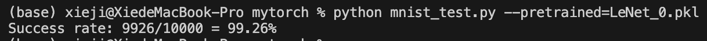

### 3.2 消融实验

由于变量太多，而且与我们组的 Part 1 有很多重复，因此这里只简单列出了一些消融实验的结果，以证明自己手写代码的正确性。

#### 3.2.1 使用 MSE 而不是交叉熵。

最高准确率是 $97.62\%$，比使用交叉熵低了 $1.64\%$。

#### 3.2.2 不使用 BatchNorm

最高准确率是 $98.61\%$，比使用 BatchNorm 低了 $0.65\%$。

#### 3.2.3 不使用数据增强

最高准确率是 $99.03\%$，比使用数据增强低了 $0.23\%$。这还是在第 $44$ 个 `epoch` 时的结果，这说明了数据增强的重要性。

## 4. 遇到的困难

- 最大的困难是 `Python` 基础语法、面向对象特性的一些研究和学习。因为我们只学过 `C`/`C++`，对 `Python` 的一些特性不太熟悉，比如 `__setattr__`、`__getattr__`、`__init__` 等等。这些特性在我们的代码中用得很多，所以我们花了很多时间去学习这些特性。

- 交叉熵损失函数训练很容易得到 `nan`。这是因为我一开始采用的架构是 `softmax` 和交叉熵分开进行，也就是先计算 `softmax`，然后再计算交叉熵。这样会导致数值不稳定，尤其是反向传播的计算上，因为 `softmax` 的输出值很容易得到接近 `0` 和 `1` 的值，如果使用数值裁剪（`clip` 函数），则会导致梯度不稳定，给 `ln` 里加上一个 `eps = 1e-12` 也没能解决问题。我们还尝试了把 `float32` 换成精度更高的 `float64`，也无济于事。过了很长一段时间，经过组员之间的讨论，我们决定将 `softmax` 和交叉熵合并在一起，而且我们还惊奇地发现，求出的导函数形式也特别美观，顺利地让梯度变得稳定下来。

- 有很长一段时间内模型的正确性能达到 $93\%$ 左右，但是更改一点架构就会变成 $10\%$，后来我们发现我们将图片 `Tensor` 进行 `reshape` 操作时，没有考虑到梯度的 `reshape`，导致梯度整体丢失，这样导致最顶端的参数根本没得到训练！后来我们手写了 `view` 函数，解决了这个问题。

# 小组成员分工：

- 谢集：`mytorch` 的框架编写和测试，以及对应部分报告撰写 + 报告整合。

- 李浩浩：`mytorch` 的框架编写和测试，以及对应部分报告撰写。

- 杨正宇：`ViT` 部分的 `Pytorch` 实现，以及对应部分报告撰写。

- 赵一帆：`CNN`+`ResNet` 部分的 `Pytorch` 实现，以及对应部分报告撰写。

每一个部分都有组员之间的互相帮助和讨论。